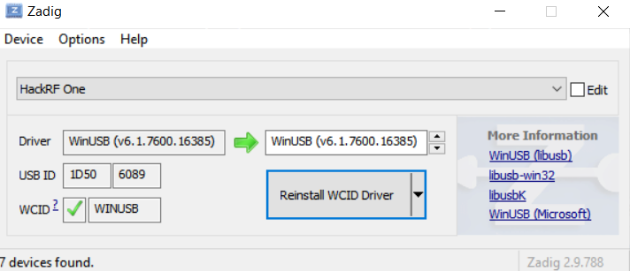

# Medición y análisis de espectro con HackRF en Windows


Este proyecto recoge scripts para capturar el espectro con `hackrf_sweep` (herramienta oficial de HackRF) y analizar los datos en Python. Está siendo empleado para el desarrollo de mi TFG y las medidas han sido tomadas en el Centro Universitario de Mérida.
 Incluye:

- Captura en Windows con PowerShell usando `hackrf_sweep`.
- Análisis de CSVs (salida de `hackrf_sweep`) y generación de gráficas.
- Enfoque en el rango LoRa EU868 (aprox. 863–871 MHz).

## Requisitos

- Windows 10/11.
- HackRF One con firmware correcto.
- Paquete de herramientas HackRF para Windows (carpeta `hackrf-tools-windows/`).
- Python 3.9+ con `pandas`, `numpy`, `matplotlib`.

Instala dependencias de Python:

```bash
pip install pandas numpy matplotlib
```

## Conectar y verificar el HackRF

1. Conecta el HackRF al PC.
2. Verifica que Windows lo detecta con `hackrf_info`:

```powershell
./hackrf-tools-windows/hackrf_info.exe
```

3. Si no aparece el dispositivo, instala el driver con Zadig:
	 - Descarga Zadig desde https://zadig.akeo.ie/.
	 - Abre Zadig, menú `Options` → activa `List All Devices`.
	 - Selecciona `HackRF One` en la lista.
	 - Elige el driver `WinUSB` y pulsa `Install Driver`.
	 - Vuelve a probar `hackrf_info`.


## Conceptos clave de `hackrf_sweep`

- `hackrf_sweep` barre un rango de frecuencias repetidamente (muchos barridos por segundo) y vuelca potencias por “bins”.
- El barrido se hace en bloques de 5 MHz; la salida CSV queda dividida en secciones de 5 MHz en 5 MHz, cada fila con:
	- Timestamp, frecuencia inicial del bloque (Hz), ancho de bin (Hz) y luego las potencias por bin desde la columna 6 en adelante.
- Puedes definir el rango con `-f min:max` (en MHz), y el tamaño del bin con `-w` (en Hz). El LNA/VGA se ajusta con `-l` y `-g`.

Ejemplo básico de uso manual (ruta según tu carpeta):

```powershell
./hackrf-tools-windows/hackrf_sweep.exe -f 863:870 -w 100000 -l 32 -g 20 > captura_universidad.csv
```

En este ejemplo:
- Rango: 863 a 870 MHz.
- Bin: 100 kHz.
- Ganancias: LNA 32 dB, VGA 20 dB.
- La salida se guarda en `captura_universidad.csv`.

## Script de captura en PowerShell

Archivo: [script_medicion.ps1](script_medicion.ps1)

Qué hace:
- Verifica la ruta de `hackrf_sweep.exe`.
- Configura rango (MHz), `BinWidth` (Hz) y ganancias (`LnaGain`, `VgaGain`).
- Lanza `hackrf_sweep` con argumentos robustos (array) y redirige la salida estándar a un CSV.
- Mantiene la captura durante `DuracionSegundos` y después cierra el proceso.

Parámetros por defecto (puedes editarlos en el script):
- `FreqMin = 863`, `FreqMax = 870` (MHz)
- `BinWidth = 100000` (100 kHz)
- `LnaGain = 32`, `VgaGain = 20`
- `DuracionSegundos = 60`
- `OutputFile = captura_universidad.csv`

Ejecutar el script:

```powershell
PowerShell -ExecutionPolicy Bypass -File .\script_medicion.ps1
```

Salida esperada: un CSV con bloques de 5 MHz y potencias por bin. El eje X reconstruido en los análisis típicamente va de ~863 a ~871 MHz según configuración.

## Análisis con Python

Hay dos scripts de análisis que parten del CSV:

### Análisis “Waterfall” y umbral dinámico

Archivo: [analisis_lora.py](analisis_lora.py)

Qué hace:
- Reconstruye una matriz “waterfall” (tiempo × frecuencia) uniendo los bloques de 5 MHz por `start_freq` (columna 2) y `bin_width` (columna 4).
- Estima el piso de ruido con un histograma y fija un umbral dinámico (+6 dB sobre el modo).
- Calcula ocupación por canales LoRa (868.1, 868.3, 868.5, 869.525 MHz) promediando potencia en ±62.5 kHz alrededor de cada canal.
- Grafica:
	- Espectrograma (waterfall) del rango de interés (por defecto 863–870 MHz).
	- Histograma de energía con piso de ruido y umbral.
	- Espectro agregado (promedio y “max hold”) con línea de umbral.

Ejecutar:

```bash
python analisis_lora.py
```

Entrada: `captura_universidad.csv`.

### Análisis de ocupación de canales LoRa

Archivo: [analisis_lora_v2.py](analisis_lora_v2.py)

Qué hace:
- Reconstruye la matriz tiempo-frecuencia completa agrupando bloques por frecuencia inicial (columna 2).
- Usa un umbral fijo de detección (`UMBRAL_DB = -55 dBfs`) para identificar señales activas (se debe modificar manualmente o se puede dejar que el programa lo calcule él mismo, a gusto del usuario).
- Calcula ocupación temporal (duty cycle) de canales LoRa (868.1, 868.3, 868.5, 869.525 MHz):
	- Considera el canal "ocupado" si la potencia media en su ancho de banda (125 kHz) supera el umbral(dependerá de cual sea el umbral de ruido).
	- Reporta el porcentaje de tiempo ocupado para cada canal.
- Genera 2 gráficas de alta calidad (300 DPI):
	1. **analisis_lora_vertical.png**: Espectrograma (waterfall) y estadísticas del espectro (promedio, max hold) con líneas verticales en canales LoRa.
	2. **histograma_ocupacion_lora.png**: Barras de ocupación por canal con indicador visual del límite de duty cycle (1%) según normativa ETSI.
- Rango de visualización por defecto: 862–871 MHz.(En este caso incluí 1 MHz de margen para poder acotar mejor y poder tener datos extras si fuera necesario)

Ejecutar:

```bash
python analisis_lora_v2.py
```

Entrada: `captura_aulario_1hora.csv` (configurable en variable `file_path`). 
Salida: `analisis_lora_vertical.png`, `histograma_ocupacion_lora.png` y resumen de ocupación por consola.

## Consejos de captura y análisis

- Ajusta `BinWidth` para equilibrar resolución en frecuencia y tamaño del CSV.
- Si ves un eje de frecuencia incompleto, amplía el rango con `-f` o aumenta `DuracionSegundos` para acumular más barridos.
- Mantén las antenas y el entorno estables; el ruido ambiental puede mover el piso de ruido.
- Si el CSV viene en UTF-16 (habitual cuando se redirige en PowerShell), los scripts intentan automáticamente cargar UTF-8 y luego UTF-16.

## Estructura del proyecto

- [hackrf-tools-windows/](hackrf-tools-windows/): binarios de HackRF para Windows (`hackrf_info.exe`, `hackrf_sweep.exe`, etc.).
- [script_medicion.ps1](script_medicion.ps1): captura automatizada con `hackrf_sweep`.
- [analisis_lora.py](analisis_lora.py): waterfall, histograma y espectro agregado.
- [analisis_lora_v2.py](analisis_lora_v2.py): espectro reconstruido y duty cycle con informe canales LoRa.
- [captura_universidad.csv](captura_universidad.csv): ejemplo de salida de `hackrf_sweep`.
- [captura_universidad_pilla_bandaLora.csv](captura_universidad_pilla_bandaLora.csv): otra captura centrada en LoRa.

## Problemas comunes

- “No se detecta HackRF”: instala driver WinUSB con Zadig y reintenta `hackrf_info`.
- “CSV vacío o corrupto”: comprueba la ruta de `hackrf_sweep.exe`, permisos de PowerShell y que el dispositivo no esté en uso por otra app.
- “Gráficas sin datos 863–871”: ajusta `-f` en la captura o modifica los límites `plt.xlim(...)` en los scripts.

---

